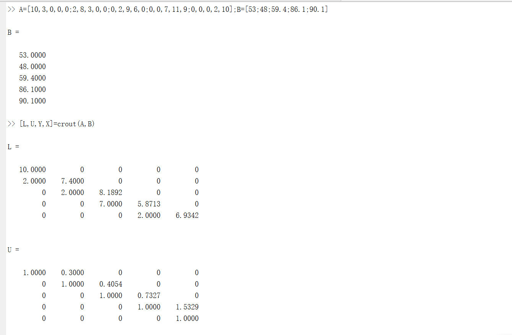
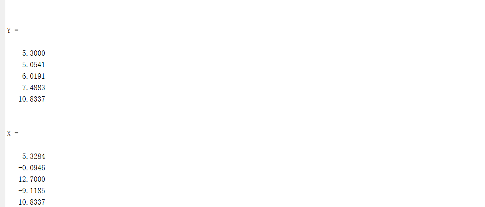
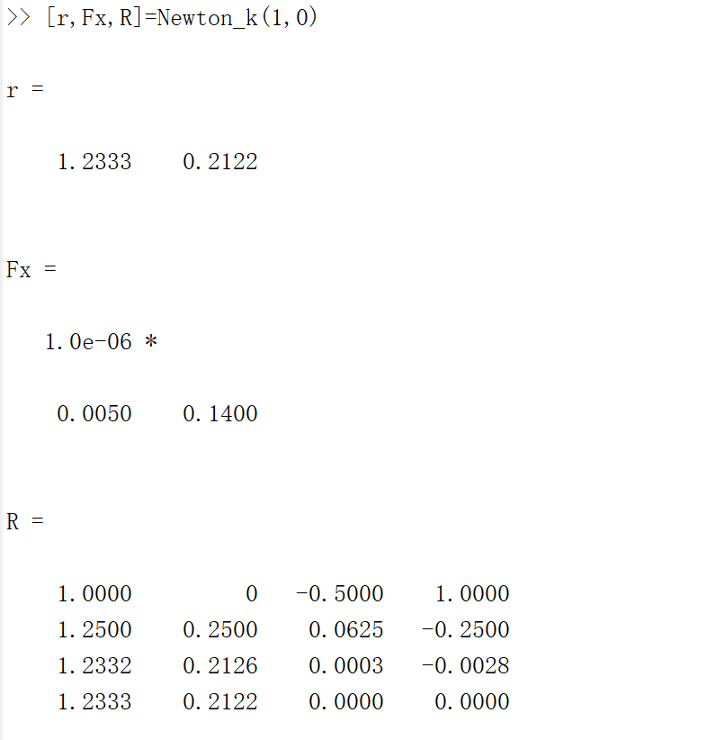

# Lab-Work

## TP 1

### TP 1-1

#### 离散线性方程

**牛顿插值**

若有$x_0,x_1\dots x_k$以及$y_0,y_1\dots y_k$，则牛顿插值的公式如下
$P_n(x) = f(x_0) + f(x_0,x_1)(x-x_0) + f(x_0,x_1,x_2)(x-x_0)(x-x_1) + \cdots + f(x_0,x_1,\ldots,x_n)(x-x_0)(x-x_1)\cdots(x-x_{n-1})$
其中

$$
\begin{cases}
f(x_0) = f(x_0) \\
f(x_0,x_1) = \frac{f(x_1) - f(x_0)}{x_1 - x_0} \\
f(x_0,x_1,x_2) = \frac{f(x_1,x_2) - f(x_0,x_1)}{x_2 - x_0} \\
\vdots \\
f(x_0,x_1,\ldots,x_k) = \frac{f(x_1,\ldots,x_k) - f(x_0,\ldots,x_{k-1})}{x_k - x_0}
\end{cases}
$$

**拉格朗日插值**

$L_1(x),L_2(x)\dots L_k(x)$为拉格朗日插值法的基函数，其公式如下

$$
\begin{cases}
L_1(x) = \frac{(x - x_2)(x - x_3)(x - x_4)...(x - x_n)}{(x_1 - x_2)(x_1 - x_3)(x_1 - x_4)...(x_1 - x_n)} \\
L_2(x) = \frac{(x - x_1)(x - x_3)(x - x_4)...(x - x_n)}{(x_2 - x_1)(x_2 - x_3)(x_2 - x_4)...(x_2 - x_n)} \\
L_3(x) = \frac{(x - x_1)(x - x_2)(x - x_4)...(x - x_n)}{(x_3 - x_1)(x_3 - x_2)(x_3 - x_4)...(x_3 - x_n)} \\
\vdots \\
L_k(x) = \frac{(x - x_1)(x - x_2)(x - x_3)...(x - x_{k-1})(x - x_{k+1})...(x - x_n)}{(x_k - x_1)(x_k - x_2)(x_k - x_3)...(x_k - x_{k-1})(x_k - x_{k+1})...(x_k - x_n)}
\end{cases}
$$

插值的多项式函数为$P(x) = \sum_{i=1}^n y_i L_i(x)$
</br><br>

#### 流程图

**牛顿插值**

```mermaid
graph LR;
    A[输入已知数据点的x坐标和y坐标] --> B[初始化差商表为离散点的y值];
    B --> C[计算差商表中的值];
    C --> D[输入插值点的x坐标];
    D --> E[计算插值点的函数值];
    E --> F[输出插值点的函数值];
    C --> G[迭代计算差商表中的值];
    G --> C;
```

**拉格朗日插值**

```mermaid
graph LR;
A[输入观测点的x坐标和y坐标] --> B[输入要插值的点的x坐标];
B --> C[初始化插值结果为0];
C --> D[循环计算每个基函数的值];
D --> E[计算当前基函数的值];
E --> F[求和更新插值结果];
F --> G{是否计算完所有基函数};
G -- 是 --> D;
G -- 否 --> H[输出插值结果];
```

</br><br>

#### 代码

**牛顿插值**

```matlab
function y = newtonzi(X, Y, x)
% 牛顿插值函数
% X: 已知数据点的x坐标
% Y: 已知数据点的y坐标
% x: 插值点的x坐标
% y: 插值点的函数值
% 传入离散值的x坐标数组和y坐标数组，以及插值点的x坐标数组，返回插值点的函数值数组

n = length(X); % 已知数据点的数量
A = zeros(n, n); % 初始化差商表
A(:, 1) = Y'; % 第一列为已知数据点的y坐标
for j = 2:n % 遍历差商表的每一列
    for k = j:n % 遍历差商表的每一行
        A(k, j) = (A(k, j-1) - A(k-1, j-1)) / (X(k) - X(k-j+1)); % 计算差商表中的值
    end
end

m = length(x); % 插值点的数量
y = zeros(1, m); % 初始化插值点的函数值
for t = 1:m % 遍历每个插值点
    z = x(t); % 当前插值点的x坐标
    s = Y(1); % 初始化插值点的函数值
    for k = 1:n % 遍历差商表的每一行
        p = 1.0; % 初始化一个乘积
        for j = 1:k-1 % 遍历每个已知数据点
            p = p * (z - X(j)); % 计算乘积
        end
        s = s + A(k, k) * p; % 计算插值点的函数值
    end
    y(t) = s; % 存储插值点的函数值
end
```

**拉格朗日插值**

```matlab
% 拉格朗日插值函数
function y = lagrange(x, y, x0)
    n = length(x);
    y0 = 0;
    for i = 1:n
        L = 1;
        for j = 1:n
            if j ~= i
                L = L .* (x0 - x(j)) / (x(i) - x(j));
            end
        end
        y0 = y0 + y(i) * L;
    end
    y = y0;
end
```

</br><br>

#### 运行结果

**牛顿插值**


**拉格朗日插值**


### TP 1-2

#### 代码

```matlab
clc,clear;
%在0-2pi内均匀分出41个离散点
x_0=linspace(0,2*pi,41);
y_0=sin(x_0);
%重构0-2pi内均匀的101个离散点
y1=zeros(1,101);
x_a=linspace(0,2*pi,101);
%拉格朗日插值
for i=1:length(x_a)
    y1(i)=lagrange_interp(x_0,y_0,x_a(i));
end
%牛顿插值
y2=newtonzi(x_0,y_0,x_a);
%误差分析
error1=mean((y1-sin(x_a)).^2);
error2=mean((y2-sin(x_a)).^2);
disp("拉格朗日插值误差为"+error1+",牛顿插值误差为"+error2);
```

#### 运行结果以及结果分析


### TP 1-3

#### 离散线性方程

追赶法中的 Crout 分解，以下为 Crout 分解矩阵的分解过程

$$
\begin{aligned}
&\begin{bmatrix}L_{11}&0&0\\L_{21}&L_{22}&0\\L_{31}&L_{32}&L_{33}\end{bmatrix}*\begin{bmatrix}1&U_{12}&U_{13}\\0&1&U_{23}\\0&0&1\end{bmatrix}=\begin{bmatrix}L_{11}&L_{11}*U_{12}&L_{11}*U_{13}\\L_{21}&L_{21}*U_{12}+L_{22}&L_{21}*U_{13}+L_{22}*U_{23}\\L_{31}&L_{31}*U_{12}+L_{32}&L_{31}*U_{13}+L_{32}*U_{23}+L_{33}\end{bmatrix} \\
\\
&\begin{bmatrix}L_{11}&L_{11}*U_{12}&L_{11}*U_{13}\\L_{21}&L_{21}*U_{12}+L_{22}&L_{21}*U_{13}+L_{22}*U_{23}\\L_{31}&L_{31}*U_{12}+L_{32}&L_{31}*U_{13}+L_{32}*U_{23}+L_{33}\end{bmatrix}=\begin{bmatrix}A_{11}&A_{12}&A_{13}\\A_{21}&A_{22}&A_{23}\\A_{31}&A_{32}&A_{33}\end{bmatrix}
\end{aligned}
$$

所以有

$$
\begin{aligned}L_{ij}&=A_{ij}-\sum_{k=1}^{j-1}L_{ik}*U_{kj}\\
\\U_{ij}&=\frac{A_{ij}-\sum_{k=1}^{i-1}L_{ik}*U_{kj}}{U_{ii}}\end{aligned}
$$

#### 流程图

```mermaid
graph LR
A[开始] --> B{"迭代j=1:n"}
B --> |是| C["更新L"]
C --> D["更新U"]
D --> B
B --> |否| E["解下三角线性方程组Ly=b"]
E --> F["解上三角线性方程组Ux=y"]
F --> G[结束]
```

#### 代码

```matlab
function [L, U,Y,X] = crout(A,B)
  [m, n] = size(A);
  L = zeros(n, n);%初始化零矩阵
  U = eye(n);%初始化单位矩阵
  Y=zeros(1,n);
  X=zeros(1,n);
  assert(m == n)%断言矩阵为方阵
  assert(length(eigs(A)) == n)%断言矩阵为非奇异的
  for j = 1:n
    L(j:n, j) = A(j:n, j) - L(j:n, 1:j-1) * U(1:j-1, j);%更新矩阵中第j到n行的列
    U(j, j+1:n) = 1 / L(j, j) * (A(j, j+1:n) - L(j, 1:j-1) * U(1:j-1, j+1:n));%更新矩阵中第j+1到n列的行
  end
Y = L\B;%%解Ly=b
X = U\Y;%%解Ux=y
end
```

#### 运行结果以及结果分析




### TP 1-4

####离散线性方程

$$
\begin{aligned}
&x_{n+1}=x_n-\left[J_F(x_n)\right]^{-1}F(x_n)\\
&\left.F=\left[\begin{array}{c}y+x^2-0.5-x\\x^2-5xy-y\end{array}\right.\right]=\left[\begin{array}{c}-0.5\\1\end{array}\right]=,F’=\left[\begin{array}{cc}2x-1&1\\2x-5y&-5x-1\end{array}\right]=\left[\begin{array}{cc}1&1\\2&-6\end{array}\right] \\
&X_1=\begin{bmatrix}1\\0\end{bmatrix}-\begin{bmatrix}1&1\\2&-6\end{bmatrix}^{-1}\begin{bmatrix}-0.5\\1\end{bmatrix}=\begin{bmatrix}1.25\\0.25\end{bmatrix} \\
&F=\begin{bmatrix}0.0625\\-0.25\end{bmatrix}=,F'=\begin{bmatrix}1.5&1\\1.25&-7.25\end{bmatrix} \\
&\left.X_2=\left[\begin{matrix}1.25\\0.25\end{matrix}\right.\right]-\left[\begin{matrix}1.5&1\\1.25&-7.25\end{matrix}\right]^{-1}\left[\begin{matrix}0.0625\\-0.25\end{matrix}\right]=\left[\begin{matrix}1.2332\\0.2126\end{matrix}\right] \\
&...
\end{aligned}
$$

#### 流程图

```mermaid
graph LR;
    A[开始] --> B[输入初始值x0];
    B --> C[定义符号变量x和y];
    C --> D["计算方程组F(x,y)"];
    D --> E[计算雅可比矩阵Fjacobi];
    E --> F[计算新的迭代点r];
    F --> G[判断是否满足收敛条件];
    G -- 是 --> H[输出迭代结果];
    G -- 否 --> I[更新迭代点的值r];
    I --> D;
```

#### 代码

```matlab
%此函数用于求方程组
function [r,Fx,R]=Newton_k(x0,y0,eps)%定义两个函数
if nargin==2 %如果传入变量只有x0时，则默认精度为1e-6；
    eps=1e-6;
end

%定义符号变量x和y
syms x y
F=[y+x^2-0.5-x,x^2-5*x*y-y];
%设定一个求雅可比行列式的矩阵
Fjacobi=jacobian(F,[x,y]);
tol=1;
r=[x0,y0];
R=[];
while tol>eps
    % 通过subs给F函数中的x和y附具体数值
    Fx=subs(F,[x,y],r);
    Fx=double(Fx);
    R=[R;[r,Fx]];  %记录x，y以及迭代点的两个函数值
    Fxjacobi=double(subs(Fjacobi,[x,y],r)); %给雅可比行列式赋值
    rr=(r'-Fxjacobi\Fx')';%计算雅可比矩阵Fxjacobi的逆矩阵与Fx的转置矩阵的乘积
    tol=norm(rr-r);
    r=rr;
end
end
```

####运行结果以及结果分析


### TP 2-1

#### 离散线性方程

**单点积分格式**

$$
\int_a^b f(x)dx \approx (b-a) \cdot f(a)
$$

**梯形积分格式**

$$
\int_a^b f(x)dx \approx \frac{b-a}{2} \cdot (f(a)+f(b))
$$

**高斯积分格式**
在区间$[-1,1]$上，高斯-勒让德求积公式为

$$
\int_{-1}^{1} f(x)dx \approx \sum_{k=0}^{n} A_kf(x_k)
$$

三点高斯-勒让德求积公式为

$$
\int_{-1}^{1} f(x) dx \approx \frac{5}{9}f(\frac{-\sqrt{15}}{5})+\frac{8}{9}f(0)+\frac{5}{9}f(\frac{-\sqrt{15}}{5})
$$

若积分区间不是$[-1,1]$而是$[a,b]$时
则

$$
\int_{a}^{b} f(x) dx=\frac{b-a}{2}\int_{-1}^{1}f(\frac{b-a}{2}x+\frac{a-b}{2})dx=\frac{b-a}{2}\sum_{N}^{k=1}\omega_{N,k}f(\frac{a+b}{2}+\frac{b-a}{2}x_{N,k})
$$

#### 流程图以及实现思路

对于三种积分方式，虽然计算公式不同，但是实现思路是一样的

```mermaid
graph LR
A(开始)-->B(设置积分函数)
B-->C("初始化等分区间为1，并计算准确积分")
C-->D(初始化步长)
D-->F(计算近似的积分值)
F-->G(比较准确积分与数值积分以判断误差是否满足要求)
G--是-->H(输出近似的积分值和等分区间数)
G--否-->D
H-->I(结束)
```

#### 代码

**单点积分**

```matlab
function [intgr,num] = single_point_integr(a,b)%a,b为积分区间
f=@(x) 0.1.*x.^2+0.2.*x-2.*sin(x).*cos(x);%设置积分函数
n=1;%初始等分区间为1
h=b-a;%初始的步长
tol=1e-6;%设置精度
fun_1=integral(f,a,b);%matlab计算出的准确的积分值
fun_2=f(b)*h; %调用方程函数
while abs(fun_2-fun_1)>tol
 n=n+1;
 h=(b-a)/n;
 fun_2=0;
    for i=0:n-1
          x=a+i*h;
          x1=x+h;
          fun_2=fun_2+h*f(x1);%按区间累加以获得[a,b]区间的数值积分
    end
    if n>9999%若划分的区间很大时仍无法达到所需精度则跳出循环
        break;
    end
end
intgr=fun_2;num=n;
end
```

**梯形积分**

```matlab
function [intgr,num] = td_integr(a,b)%a,b为积分区间
f=@(x) 0.1.*x.^2+0.2.*x-2.*sin(x).*cos(x);%设置积分函数
n=1;%初始等分区间为1
h=b-a;%初始的步长
tol=1e-6;
fun_1=integral(f,a,b);%matlab计算出的准确的积分值
fun_2=(f(a)+f(b))*(h/2); %调用方程函数
while abs(fun_2-fun_1)>tol
 n=n+1;
 h=(b-a)/n;
 fun_2=0;
    for i=0:n-1
          x=a+i*h;
          x1=x+h;
          fun_2=fun_2+(h/2)*(f(x)+f(x1));%按区间累加以获得[a,b]区间的数值积分
    end
end
intgr=fun_2;num=n;
end
```

**三点高斯-勒让德积分**

```matlab
function [result,num]= gauss_legendre_integr(a,b)
    % 高斯-勒让德求积公式三点情况
    GaussP = [-sqrt(15)/5, 0, sqrt(15)/5]; % 高斯点
    GaussA = [5/9,8/9,5/9]; % 高斯系数
    n=1;%定义初始区间个数
    h=b-a;%定义初始步长
    f=@(x) 0.1.*x.^2+0.2.*x-2.*sin(x).*cos(x);
    fun_1 = integral(f, a, b); % 计算准确的积分值
    error=1e-20;%%规定精度为1e-20
    fun_2 =0;
    for i=1:3
        fun_2=((b-a)/2)*GaussA(i)*f((a+b)/2+(b-a)*GaussP(i)/2)+fun_2;
    end
    while abs(fun_1-fun_2) > error
     n=n+1;
     h=(b-a)/n;
     fun_2=0;
        for i=0:n-1
          x0=a+i*h;
          x1=x0+h;
          fun_2=fun_2+((x1-x0)/2)*(GaussA(1)*f((x1+x0)/2+(x1-x0)*GaussP(1)/2)+GaussA(2)*f((x1+x0)/2+(x1-x0)*GaussP(2)/2)+GaussA(3)*f((x1+x0)/2+(x1-x0)*GaussP(3)/2));
        end
    end
    result=fun_2;
    num=n;
end

```

#### 运行结果以及结果分析

**单点积分**

未达到 1e-6 精度的误差，划分区间超过 10000 后退出循环

**梯形积分**


计算所得的数值积分值为 12.2162，划分出 2034 个区间

**三点高斯-勒让德积分**

可见达到 1e-20 精度时只划分了 7 个区间

```mermaid
graph LR
A(开始)-->B("设置参数，初始化n、C数组")
B-->C("列出方程组")
C-->E("判断i是否达到数组的数目")
E--是-->D("数值求解n(i)、C(i)(选取不同的求解方法)")
D-->F(绘图)
E--否-->F(绘图)
F-->I(结束)
```

```mermaid
graph LR
    A[初始化] --> B[初始化矩阵T，确定各个参数]
    B --> C[使用二阶差分法更新矩阵T]
    C --> G["比较新矩阵与旧矩阵，T_new-T_old的精度是否达到标准"]
    G --是--> H[跳出循环]
    G--否-->C
    H --> J[将T绘制为热图]
```
